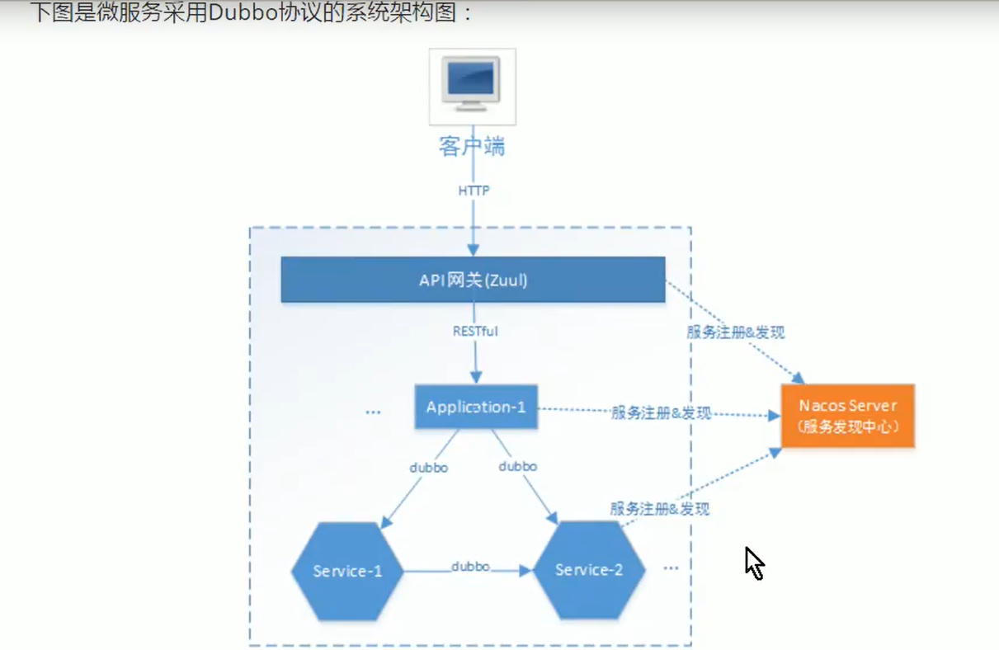

# nacos-discovery
springboot-nacos-dubbo-mybatisplus

###  spring boot 微服务架构

为了满足移动互联网对大型项目及多客户端的需求, 对服务层进行细粒度的拆分, 所拆分的每个服务都只完成某个特定的业务功能, 比如订单服务只实现订单相关的业务, 用户服务实现用户管理相关的业务等, 服务的粒度很小, 所以称为微服务架构.

UI 层

服务层

数据层

结构图


nacos 服务发现和配置管理

1. 理解微服务架构的特点

2. 理解服务发现流程

3. 说出 nacos 的功能

4. 掌握 nacos 安装

5. 掌握 RESTful 服务发现开发方法

6. 掌握 dubbo 服务发现开发方法

7. 理解 nacos 服务发现数据模型

8. 掌握 nacos 配置管理方法

9. 掌握 nacos 扩展配置方法

   

服务发现: 整个系统按指责能力划分为多个服务, 通过服务之间写作来实现业务目标. 这样再我们的代码中免不了要进行服务间的远程调用, 服务的消费方要调用服务的生产方, 为了完成一次请求, 消费方需要知道服务生产方的网络位置 ( IP 地址和端口号)

* 服务之间如何相互发现?

  服务消费方通过服务发现中心只能发现服务提供方, 从而进行远程调用的过程

  **服务发现中心: **

  

  1. 所有的微服务都要把自己的地址上报到服务发现中心(服务注册表), 通过负载均衡算法找到合适的服务实例地址

     1) 每个服务启动时会向服务发现中心上报自己的网络位置. 这样, 在服务发现中心内部会形成一个服务注册表, 服务注册表是服务发现的核心部分, 是包含所有服务实例的网络地址的数据库.

     2) 服务发现客户端会定期从五福发现中心同步服务注册表, 并缓存在客户端

     3) 当需要对某服务进行请求时, 服务实例通过该注册表, 定位目标服务网络地址, 若目标服务存在多个网络地址, 则使用负载均衡的算法从多个服务实例中选择出一个, 然后发出请求

     Dubbo 系统协议架构图



结构同时提供RESTful 和 Dubbo 接口服务, 应用层对前端提供 RESTful 接口, RESTful 是互联网通用的轻量级交互协议, 方便前端接入系统; 微服务层向应用层提供 Dubbo 接口, Dubbo 接口基于 RPC 协议速度更快.

本架构采用阿里开源的 Nacos, 集服务发现和配置中心为一体, 支持 RESTful 和 Dubbo 服务的注册.

父工程: 使用 nacos-discovery

application 1: 使用 nacos-restful-consumer;

service1 微服务: 新建

service2 微服务: 新建

api 网关: 新建

### ### service2 微服务搭建

1. 由于 service 2 对外暴露 dubbo 协议接口, 既需要为 service1 提供服务, 又要向 application 提供服务, 考虑远程接口可能会被其他服务调用, 这里将 service2 的接口单独抽取出 api 工程, service2 微服务工程的结构如下: 

### 通过 dubbo 实现远程调用步骤

假设系统中有一个应用程序, 多个微服务系统, 同时微服务系统之间还存在调用关系

1. 使用 dubbo 的服务都需要引入 dubbo 依赖和 nacos 依赖

   ```
   <!-- https://mvnrepository.com/artifact/com.alibaba.cloud/spring-cloud-starter-dubbo -->
           <dependency>
               <groupId>com.alibaba.cloud</groupId>
               <artifactId>spring-cloud-starter-dubbo</artifactId>
               <version>2.2.1.RELEASE</version>
           </dependency>
           
   <dependency>
               <groupId>com.alibaba.cloud</groupId>
               <artifactId>spring-cloud-starter-alibaba-nacos-discovery</artifactId>
               <version>2.2.1.RELEASE</version>
           </dependency>
   ```

   

2. 完成被调用的微服务的 api 和 service, 同时 service 模块需要引入 api 模块, service 模块中完成 api 中方法的实现

```java
// api 中的接口
public interface ServicePayApi {
    String dubboServicePay () ;
}
```

```java
// service 中的实现类, 同时在 pom 文件中需要添加对 api 模块的依赖
@org.apache.dubbo.config.annotation.Service
public class ServicePayApiImpl implements ServicePayApi {

    public String dubboServicePay () {
        return "service pay api implementation";
    }
}
```


1. 在应用该程序中使用 @Reference 标签标注 api 中的方法 

   ```java
   //    实现远程调用 dubbo 接口, 远程 RPC 调用
   @org.apache.dubbo.config.annotation.Reference
   ServicePayApi servicePayApi;
   
   @GetMapping(value = "/pay")
   public String getServicePayApi () {
       String providerResult = servicePayApi.dubboServicePay();
       return "远程调用 service pay dubboService pay 方法的结果: " + providerResult;
   }
   ```
